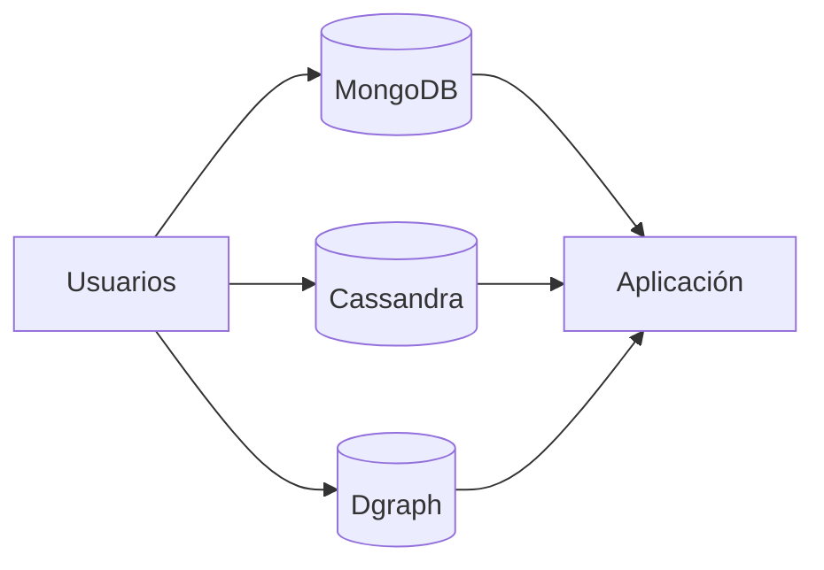
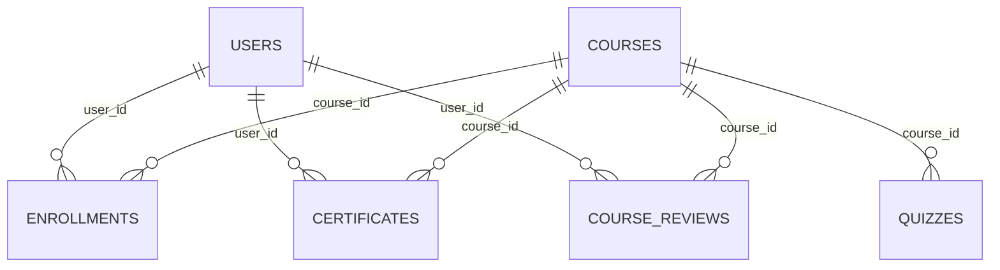
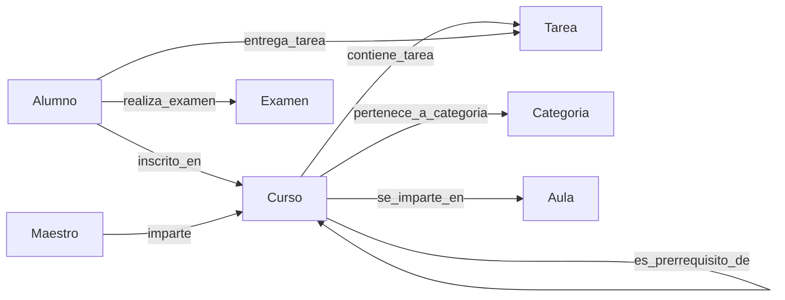

# Reporte de Revisión Intermedia — Plataforma de Educación en Línea

## 1. Introducción

Este reporte documenta la propuesta intermedia de modelado NoSQL para una plataforma de educación en línea. El diseño separa responsabilidades entre MongoDB (documentos), Cassandra (eventos temporales) y Dgraph (relaciones y recomendaciones).

## 2. Justificación del proyecto

El proyecto busca resolver casos de uso académicos reales: inscripción, seguimiento de avance, evaluaciones, actividad de aprendizaje y recomendaciones. Se seleccionan tres motores para optimizar cada tipo de consulta según su naturaleza.

## 3. Requerimientos funcionales corregidos

| ID | Base de datos | Requerimiento | Resultado esperado | Consulta que resuelve |
|---|---|---|---|---|
| M01 | MongoDB | Crear/publicar curso | Documento `courses` | Alta y publicación de cursos |
| M02 | MongoDB | Buscar/filtrar cursos | Índices text + compuestos | Búsqueda por texto/categoría/idioma |
| M03 | MongoDB | Progreso por lección | `enrollments` con avance | Estado por usuario-curso |
| M04 | MongoDB | Materiales embebidos | `lessons.attachments` | Contenido de apoyo por lección |
| M05 | MongoDB | Registro de usuarios | `users` con índices únicos | Alta y consulta de cuentas |
| M06 | MongoDB | Perfil de estudiante | Subdocumento `profile` | Consulta de perfil |
| M07 | MongoDB | Criterios de aprobación | `quizzes` | Parámetros de evaluación |
| M08 | MongoDB | Certificados por usuario | `certificates` | Listado de certificados |
| M09 | MongoDB | Historial de inscripciones | `enrollments` por estado | Historial de cursos |
| M10 | MongoDB | Reseñas de cursos | `course_reviews` | Valoración y promedio |
| C01 | Cassandra | Sesiones por estudiante | `sessions_by_student` | Sesiones recientes |
| C02 | Cassandra | Avance por lección | `lesson_progress_by_student_course` | Avance en curso |
| C03 | Cassandra | Intentos de quiz | `quiz_attempts_by_student` | Últimos intentos |
| C04 | Cassandra | Intentos por curso | `quiz_attempts_by_student_course` | Intentos filtrados |
| C05 | Cassandra | Actividad diaria | `activity_by_student_day` | Eventos por fecha |
| C06 | Cassandra | Eventos de video | `video_events_by_student` | Reproducción reciente |
| C07 | Cassandra | Actividad por curso/día | `activity_by_course_day` | Actividad reciente del curso |
| C08 | Cassandra | Entregas de tareas | `submissions_by_student_course` | Entregas recientes |
| C09 | Cassandra | Progreso por lección | `lesson_progress_by_course_lesson` | Progreso grupal por lección |
| C10 | Cassandra | Notificaciones | `notifications_by_student` | Notificaciones recientes |
| D01 | Dgraph | Inscripción alumno-curso | `inscrito_en` | Cursos del alumno |
| D02 | Dgraph | Maestro-cursos | `imparte` | Maestro de curso |
| D03 | Dgraph | Entrega de tareas | `entrega_tarea` | Tareas entregadas |
| D04 | Dgraph | Exámenes realizados | `realiza_examen` | Exámenes por alumno |
| D05 | Dgraph | Curso contiene tareas | `contiene_tarea` | Tareas de un curso |
| D06 | Dgraph | Calificaciones | Facets en relaciones | Consulta de calificación |
| D07 | Dgraph | Horario de curso | Atributos en `Curso` | Horario sin entidad extra |
| D08 | Dgraph | Recomendaciones | Traversal por categoría | Sugerencias relacionadas |
| D09 | Dgraph | Prerrequisitos | `es_prerrequisito_de` | Rutas de aprendizaje |
| D10 | Dgraph | Aula del curso | `se_imparte_en` | Ubicación/modalidad |

## 4. Modelo de datos Cassandra

Se definieron 10 tablas orientadas a consulta temporal con partition y clustering keys apropiadas.

### Resumen por tabla
- `sessions_by_student`: sesiones recientes por estudiante.
- `lesson_progress_by_student_course`: avance por lección en un curso.
- `quiz_attempts_by_student`: historial reciente de intentos.
- `quiz_attempts_by_student_course`: intentos filtrados por curso.
- `activity_by_student_day`: navegación diaria por estudiante.
- `video_events_by_student`: eventos de video por estudiante.
- `activity_by_course_day`: actividad reciente de curso por día.
- `submissions_by_student_course`: entregas de tareas.
- `lesson_progress_by_course_lesson`: progreso de alumnos por lección.
- `notifications_by_student`: notificaciones recientes.

### Ejemplo CQL
```sql
SELECT *
FROM online_learning_platform.sessions_by_student
WHERE student_id = 'U001'
LIMIT 20;
```

Justificación: Cassandra se usa para series de eventos y consultas por tiempo/partición alta cardinalidad.

## 5. Modelo de datos MongoDB

### Colecciones
- `users`: identidad y perfil.
- `courses`: catálogo y contenido embebido.
- `enrollments`: progreso e historial académico.
- `quizzes`: evaluaciones y criterios de aprobación.
- `certificates`: constancias emitidas.
- `course_reviews`: reseñas y ratings.

### Justificación de índices
- Índices únicos para identidad (`user_id`, `email`, `course_id`, `quiz_id`).
- Índice de texto para búsqueda libre de cursos.
- Índices compuestos para filtros frecuentes (usuario+curso, usuario+estado, categoría+idioma).

### Pipelines conceptuales
1. Promedio de rating por curso.
2. Resumen de progreso por usuario.
3. Cursos más populares por categoría (con `$lookup` o denormalización controlada).

## 6. Modelo de datos Dgraph

### Nodos
Alumno, Maestro, Curso, Tarea, Examen, Categoria, Aula.

### Relaciones
`inscrito_en`, `imparte`, `entrega_tarea`, `realiza_examen`, `contiene_tarea`, `pertenece_a_categoria`, `es_prerrequisito_de`, `se_imparte_en` con `@reverse`.

### Decisiones clave
- Recomendaciones en Dgraph por traversal natural de relaciones (D08).
- Horario como atributo de Curso (`day_of_week`, `start_time`, `end_time`, `modality`) y no entidad separada (D07).
- Calificaciones como atributos/facets en relaciones de entrega/intento, no relación independiente (D06).

## 7. Diagramas sugeridos

### Diagrama general del sistema


### Diagrama de colecciones MongoDB


### Diagrama de tablas Cassandra

```mermaid
flowchart TD
  S[sessions_by_student]
  LP1[lesson_progress_by_student_course]
  QA1[quiz_attempts_by_student]
  QA2[quiz_attempts_by_student_course]
  A1[activity_by_student_day]
  V[video_events_by_student]
  A2[activity_by_course_day]
  SUB[submissions_by_student_course]
  LP2[lesson_progress_by_course_lesson]
  N[notifications_by_student]
```


### Diagrama de grafo Dgraph


## 8. Infraestructura técnica

- **Estructura del repositorio:** separa esquemas por motor y scripts de soporte.
- **`connect.py`:** centraliza conexión funcional a MongoDB y Cassandra por variables de entorno/defaults.
- **`populate.py`:** define estrategia de carga detallada sin ejecutar inserciones.
- **`main.py`:** ofrece menú de consultas planeadas sin lógica de consulta real.
- **Enlace pendiente al repositorio:** `TODO: agregar URL del repositorio remoto`.

## 9. Commits esperados

1. **Commit inicial:** README con integrantes, descripción y flujo.
2. **Commit de estructura:** carpetas y archivos base (`Cassandra/`, `Mongo/`, `Dgraph/`, `data/`).
3. **Commit técnico:** `connect.py`, `populate.py` y `main.py`.

## 10. Conclusión

La propuesta intermedia cumple separación de responsabilidades por tipo de dato y consulta. El siguiente paso será implementar carga real (`populate.py`) y consultas ejecutables sobre el menú definido en `main.py`, conservando la arquitectura de modelado corregida por retroalimentación del profesor.
